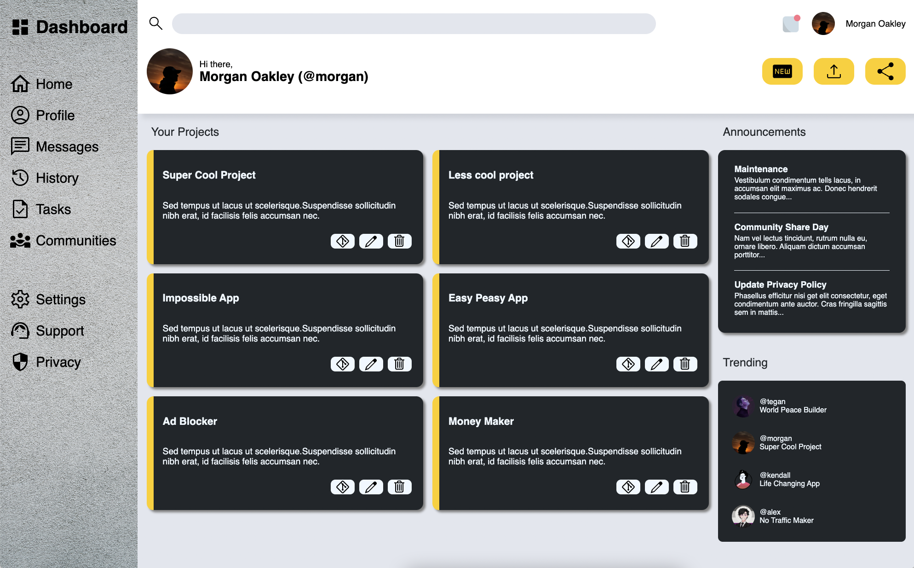

# Admin-Dashboard

Admin-Dasboard is a simple project recreated after TOP's last project from the Intermediate HTML and CSS course.


## Tech Stack


[Google Fonts  (Downloaded)](https://fonts.google.com)
## Lessons Learned

This project allowed me to practice my CSS skills. With the help of ```grid ``` i was able to easily create the layout of my Dashboard. I then used ```auto-fill``` and ```minmax()``` to make the project divs more dynamic.


## Authors

[👨🏻‍💻 @gabibamboi-x](https://www.github.com/gabibamboi-x)

